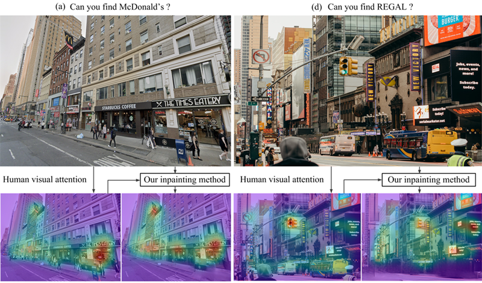
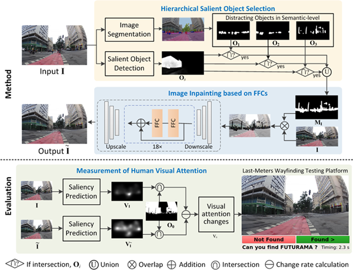

# A Saliency-Guided Street View Image Inpainting Framework for Efficient Last-Meters Wayfinding [<a href="https://arxiv.org/pdf/2205.06934.pdf?ref=https://githubhelp.com">Paper</a>] (Accepted by ISPRS Journal of Photogrammetry and Remote Sensing)

We propose a saliency-guided street view image inpainting method, which can remove distracting objects to redirect human visual attention to static landmarks.



## Summary 
Overview of the proposed saliency-guided street view image inpainting framework. It consists of three building blocks: hierarchical salient object selection, saliency-guided image inpainting based on fast Fourier convolutions (FFCs), and measurement of human visual attention by visual attention changes and a self-developed last-meters wayfinding testing platform. Note that modeling the interaction between saliency detection and image inpainting leads to effective removal of distracting objects for last-meters wayfinding.



## Usage
### Step 1 - Context-aware salient object detection (SOD)

Hierarchical salient object selection based on Image Segemmentation (<a href="https://github.com/open-mmlab/mmsegmentation/tree/master/configs/deeplabv3plus">DeepLabv3+</a>, <a href="https://github.com/open-mmlab/mmsegmentation/blob/master/configs/deeplabv3plus/deeplabv3plus_r101-d8_769x769_80k_cityscapes.py">Model</a>) and Salient Object Detection (<a href="https://github.com/xuebinqin/U-2-Net">U^2Net</a>).

### Step 2 - Image inpainting

Finetuned on LaMa model (<a href="https://github.com/saic-mdal/lama">link</a>)

### Step 3 - Measurement of human visual attention

Evaluation of human visual changes based on UNISAL network (<a href="https://github.com/rdroste/unisal">link</a>) and a self-developed human labelling program. 

## Citation
For more details please refer to our paper:
```
@article{hu2022saliency,
  title={A Saliency-Guided Street View Image InpaintISPRS Journal of Photogrammetry and Remote Sensinging Framework for Efficient Last-Meters Wayfinding},
  author={Hu, Chuanbo and Jia, Shan and Zhang, Fan and Li, Xin},
  journal={arXiv preprint arXiv:2205.06934},
  year={2022}
}
